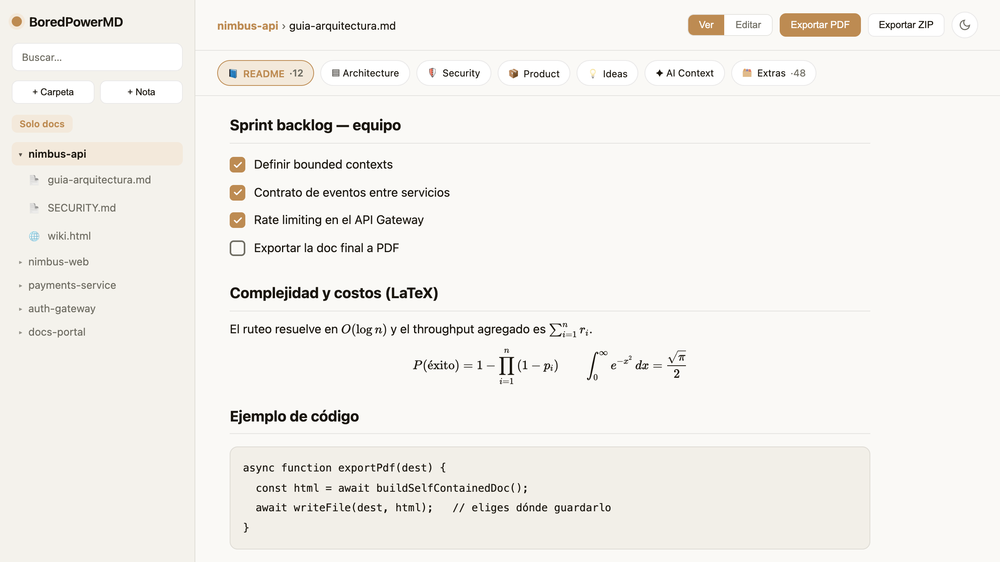
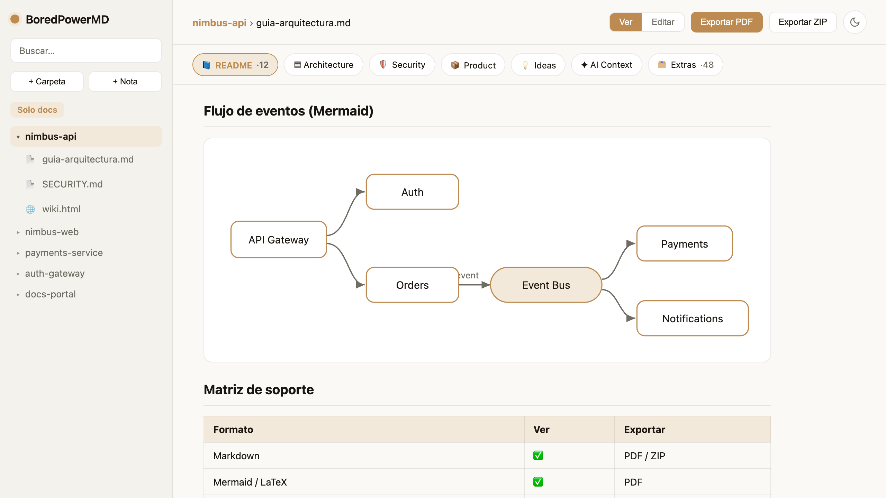
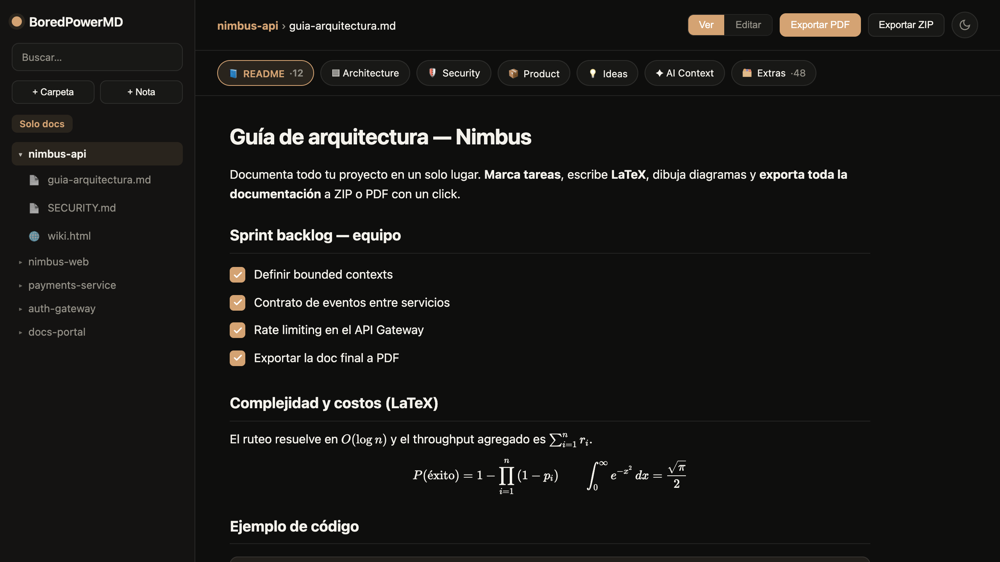
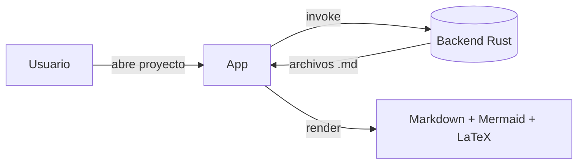
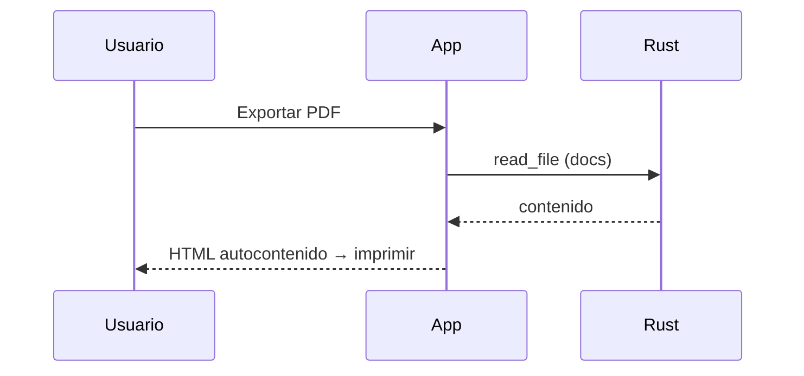

# BoredPowerMD 🪐

**Un organizador de documentación local-first para tus proyectos.** BoredPowerMD es una app de escritorio (Tauri + Vue 3 + Rust) que reúne tus README, ideas, arquitectura, políticas de seguridad y notas de cada proyecto en una sola wiki limpia — todo guardado como **archivos reales en tu disco**, listos para git. Sin nube, sin cuentas, sin base de datos: tus documentos siguen siendo tuyos.

> Pensada para desarrolladores que tienen decenas de repos y quieren ver, editar y exportar su documentación sin perderse entre carpetas.

---

## 🎬 Demo


<p align="center">
▶️ <strong><a href="docs/BoredPowerMD-demo.mp4">Ver el recorrido completo (1 min, MP4)</a></strong><br>
<em>Con un proyecto de ejemplo «Nimbus»: crear carpetas y notas, buscar al vuelo, editar en Markdown,<br>
listas de tareas entre programadores, LaTeX, diagramas Mermaid, personalizar colores, exportar a PDF/ZIP y modo claro/oscuro.</em>
</p>

---

## ✨ Características

- **Wiki por proyecto** — apunta a tu carpeta raíz (ej. `~/Documents/GitHub`) y cada subcarpeta se vuelve un proyecto navegable.
- **Categorías inteligentes** — README, Architecture, Security, Product, Contract, Ideas, AI Context y Extras. Se detectan solas por el nombre del archivo y son configurables.
- **Buscador + filtro por formato** dentro de cada categoría, para no saturarte cuando hay muchos archivos.
- **Vista previa rica de Markdown** — con diagramas **Mermaid** (UML, secuencia, flujo), fórmulas **LaTeX/KaTeX**, resaltado de código, casillas interactivas e imágenes locales.
- **Visor de HTML** integrado, con botón *"Abrir en navegador"* para páginas que enlazan entre sí.
- **Visor de PDF e imágenes**.
- **Editor** con barra de herramientas (encabezados, negrita, código, tablas, insertar imágenes desde tu gestor de archivos, LaTeX).
- **Exportar a PDF** (documento imprimible autocontenido, con portada por sección) y **exportar a ZIP** de solo la documentación — tú eliges dónde guardar.
- **Modo claro / oscuro** y color de acento personalizable.
- **Ignorar archivos** con click derecho para dejarlos fuera de las exportaciones.

---

## 📸 Capturas

**Markdown con listas de tareas y LaTeX**


**Diagramas Mermaid**


**Modo oscuro**


---

## 🎬 Ejemplos de lo que soporta

BoredPowerMD renderiza tus `.md` con todo esto (y GitHub lo muestra igual aquí abajo):

### Diagramas Mermaid (UML, flujo, secuencia)





### Fórmulas LaTeX (KaTeX)

En línea: la complejidad $O(n \log n)$ y la identidad $E = mc^2$.

En bloque:

$$
\int_{0}^{\infty} e^{-x^2}\,dx = \frac{\sqrt{\pi}}{2}
\qquad
\sum_{i=1}^{n} i = \frac{n(n+1)}{2}
$$

### Tablas, código y checklists

| Formato | Soportado | Notas |
|---|:---:|---|
| Markdown | ✅ | vista + editor |
| Mermaid | ✅ | UML, flujo, secuencia |
| LaTeX / KaTeX | ✅ | en línea y bloque |
| HTML | ✅ | visor + abrir en navegador |
| PDF / imágenes | ✅ | visor integrado |

```ts
// resaltado de sintaxis
async function exportPdf(dest: string) {
  const html = await buildSelfContainedDoc();
  await writeFile(dest, html);
}
```

- [x] Casillas interactivas que guardan su estado en el `.md`
- [x] Imágenes locales (incluso con espacios en el nombre)
- [ ] Tu próxima idea aquí

---

## 📥 Descargar (usuarios)

Ve a la pestaña **[Releases](../../releases)** y descarga el instalador para tu sistema:

| Sistema | Archivo |
|---|---|
| **macOS** (Apple Silicon e Intel) | `.dmg` |
| **Windows** | `.msi` o `-setup.exe` |

> Los builds son sin firma de código, así que la primera vez macOS/Windows pueden pedir confirmación (en Mac: click derecho → *Abrir*).

---

## 🛠️ Desarrollo (correr desde el código)

**Requisitos:** [Node.js](https://nodejs.org) y [Rust](https://www.rust-lang.org/tools/install).

```bash
# 1. Instalar Rust (una sola vez)
curl --proto '=https' --tlsv1.2 -sSf https://sh.rustup.rs | sh

# 2. Instalar dependencias y correr en modo desarrollo
npm install
npm run tauri dev
```

### Compilar los instaladores localmente

```bash
npm run tauri build
```

Los artefactos quedan en `src-tauri/target/release/bundle/`.

---

## 🧱 Stack y estructura

- **Frontend:** Vue 3 (`<script setup>`) + TypeScript + Vite
- **Backend nativo:** Rust (Tauri 2) — acceso a archivos, generación de ZIP, lectura de imágenes/PDF
- **Docs:** `marked` (Markdown) · `mermaid` (diagramas) · `katex` (LaTeX)

```
src/
  App.vue        ← toda la interfaz
  TreeNode.vue   ← árbol de archivos recursivo
  Icon.vue       ← iconos SVG
src-tauri/
  src/lib.rs     ← comandos nativos (list_dir, read_file, write_file, export_zip, …)
.github/workflows/release.yml  ← compila macOS + Windows automáticamente
```

---

## 📄 Licencia

MIT — ver [LICENSE](LICENSE).
